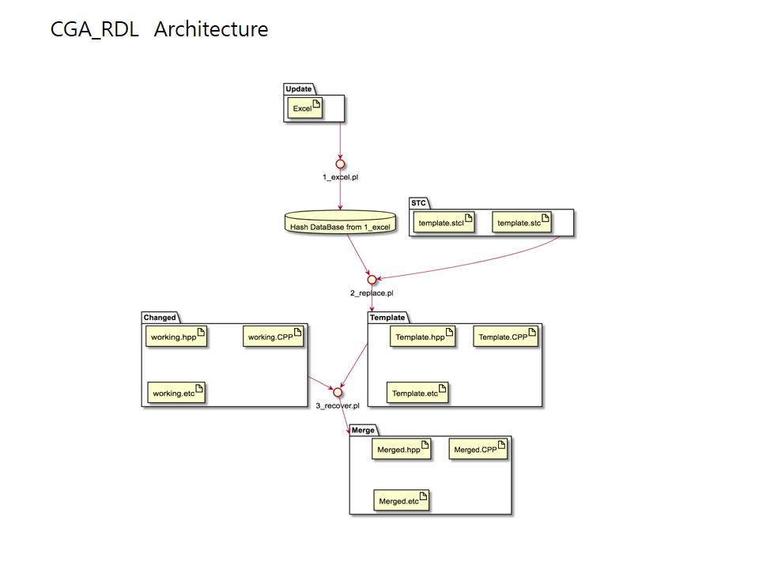
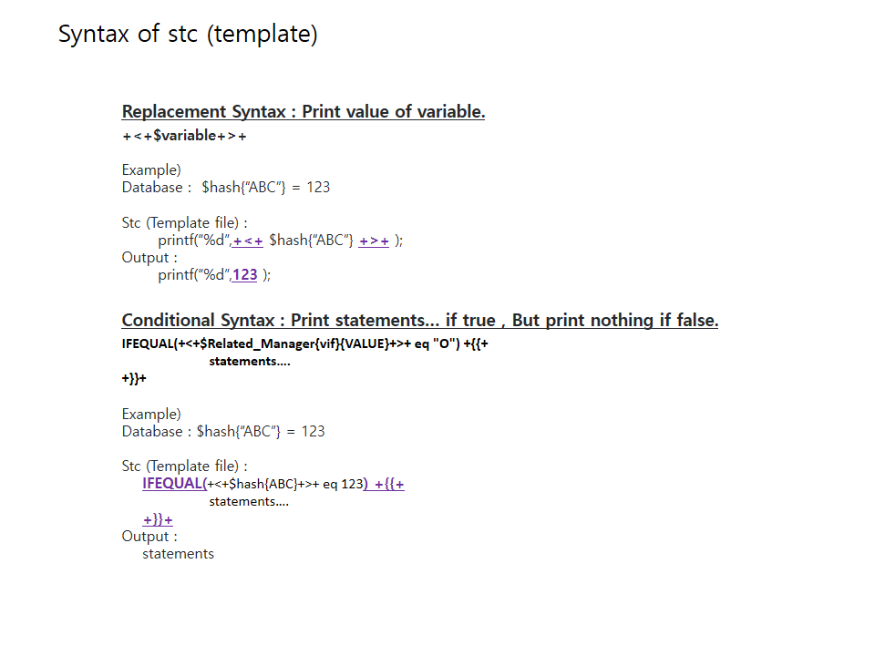
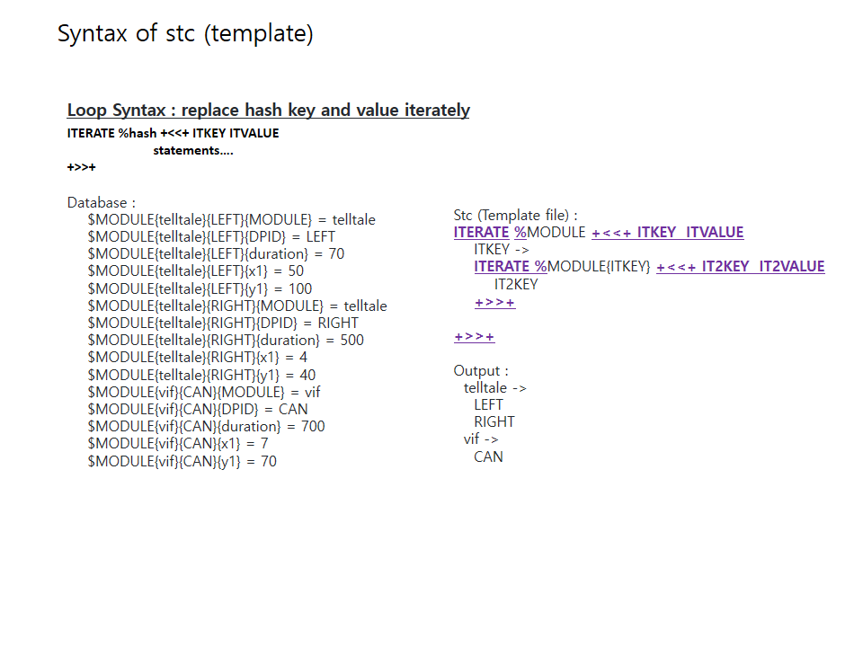
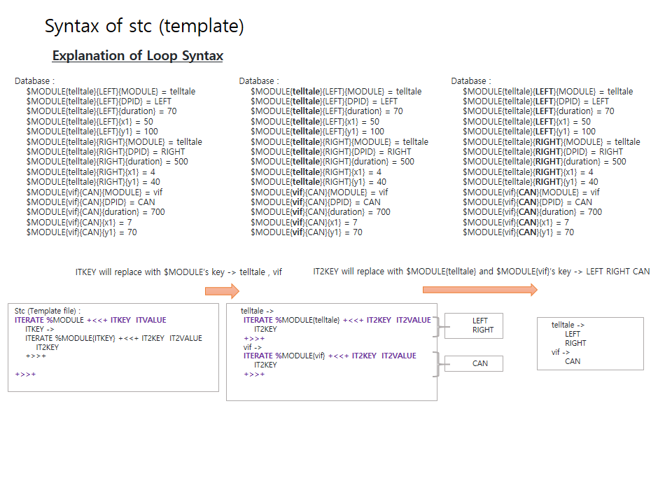
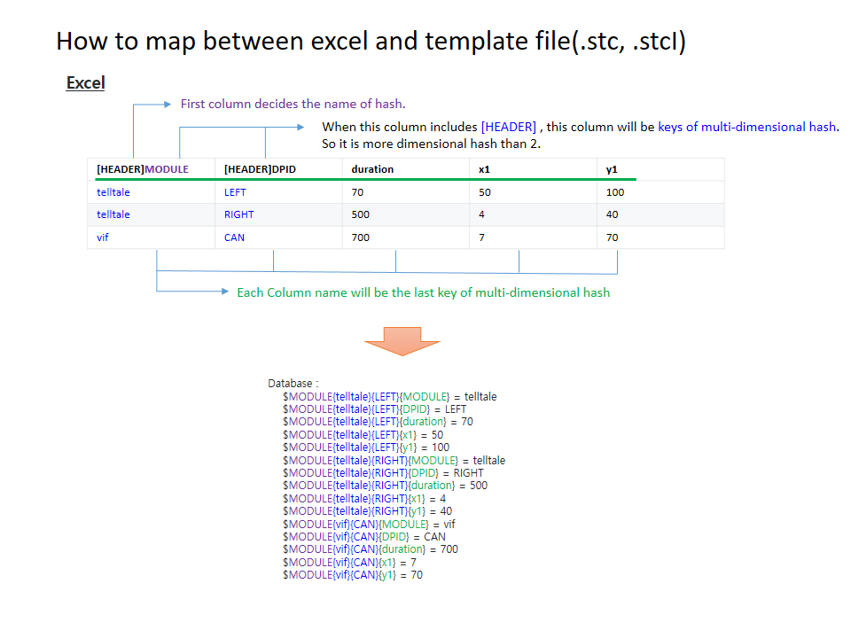
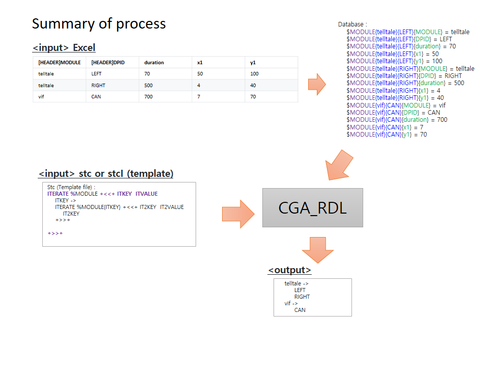
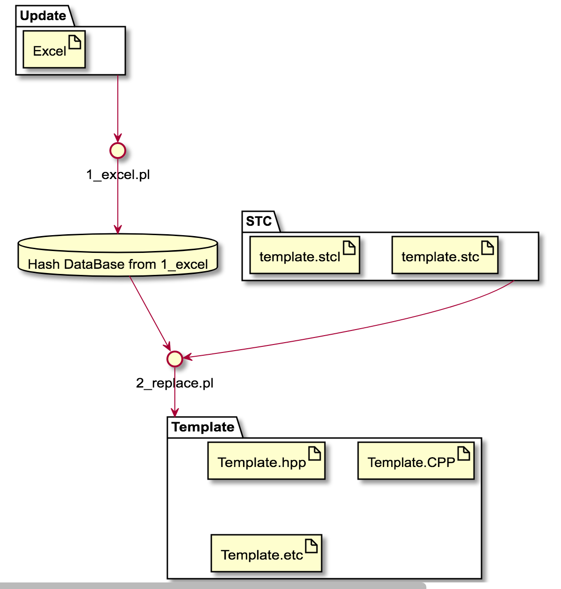
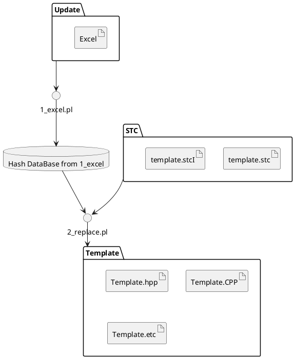
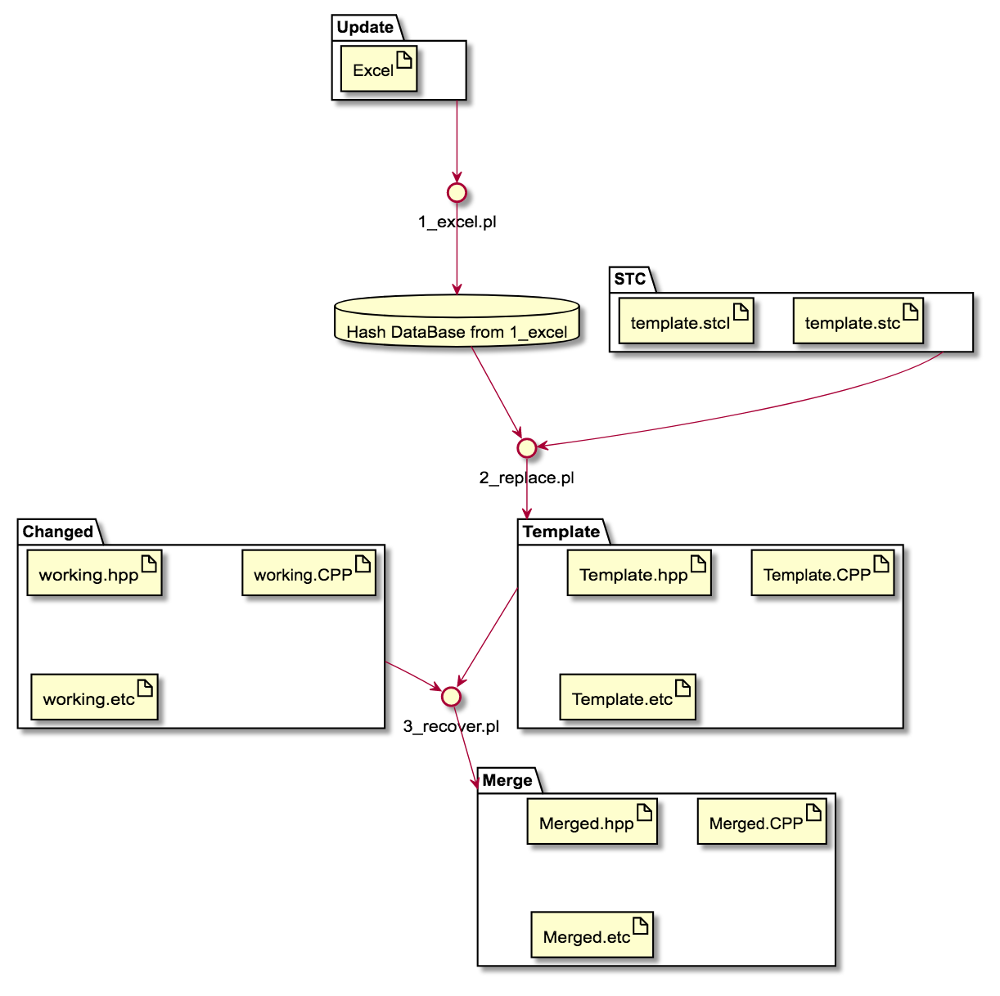
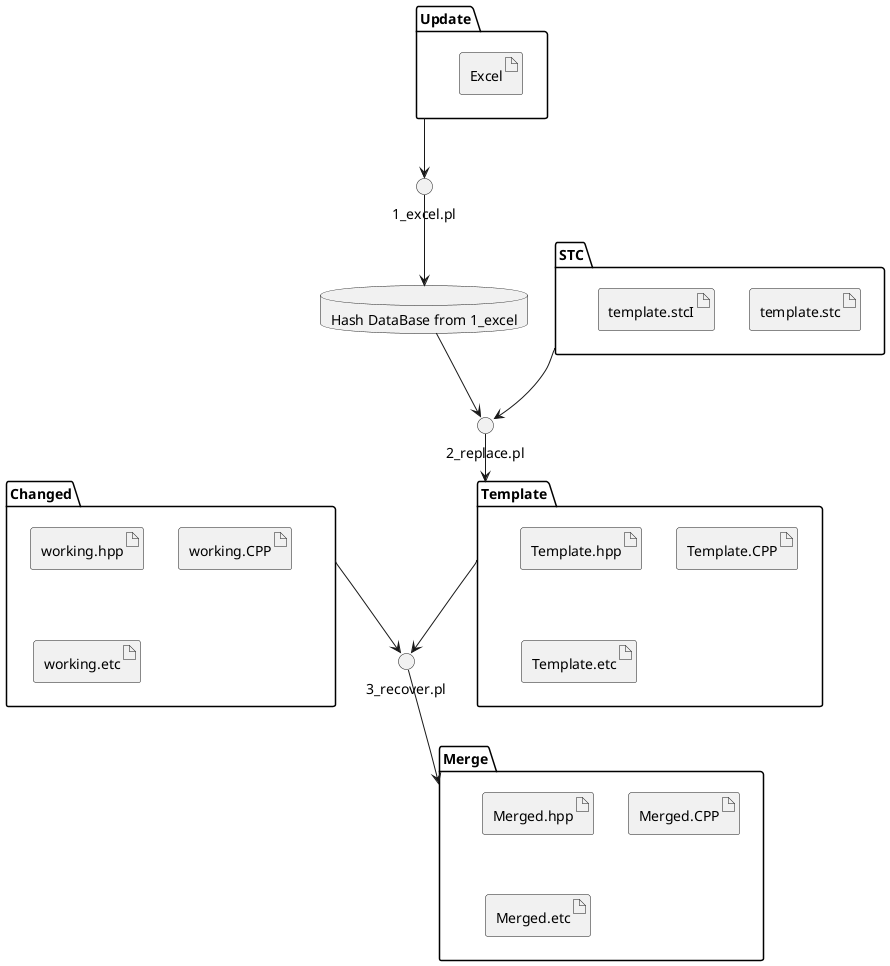

1\.  [CGA_RDL](#cga_rdl)  
1.1\.  [RDL](#rdl)  
1.2\.  [Explanation](#explanation)  
1.3\.  [Description of Syntax (2_replace.pl)](#descriptionofsyntax2_replace.pl)  
1.3.1\.  [Special case of use +<+ ....  +>+](#specialcaseofuse+<+....+>+)  
1.3.2\.  [Control and Programming in RDL](#controlandprogramminginrdl)  
1.4\.  [recover (3_recover.sh 3_recover.pl)](#recover3_recover.sh3_recover.pl)  
2\.  [Purpose](#purpose)  
3\.  [Environment](#environment)  
3.1\.  [read excel](#readexcel)  
3.2\.  [Install](#install)  
3.2.1\.  [perl module install](#perlmoduleinstall)  
4\.  [How to run the test](#howtorunthetest)  
4.1\.  [example1 (test)](#example1test)  
4.2\.  [example2 (stc)](#example2stc)  
4.3\.  [example3 (stcI)](#example3stci)  
5\.  [Process](#process)  
6\.  [Relationship between each processes (excel & database & stc file )](#relationshipbetweeneachprocessesexcel&database&stcfile)  
6.1\.  [Explanation of Example 1 (1_example.xlsx)](#explanationofexample11_example.xlsx)  
6.1.1\.  [Excel](#excel)  
6.1.2\.  [DataBase](#database)  
6.1.3\.  [stc or stcI 's replacement](#stcorstci'sreplacement)  
6.2\.  [Enhanced Example 2 with multiple [HEADER] for multi-dimension](#enhancedexample2withmultiple[header]formulti-dimension)  
6.2.1\.  [Excel](#excel-1)  
6.2.2\.  [DataBase](#database-1)  
6.3\.  [Syntax and Explanation of RDL](#syntaxandexplanationofrdl)  

<a name="cga_rdl"></a>

# 1\. CGA_RDL
```

   _____ _____            _____  _____  _
  / ____/ ____|   /\     |  __ \|  __ \| |
 | |   | |  __   /  \    | |__) | |  | | |
 | |   | | |_ | / /\ \   |  _  /| |  | | |
 | |___| |__| |/ ____ \  | | \ \| |__| | |____
  \_____\_____/_/    \_\ |_|  \_\_____/|______|
                     ______
                    |______|

```

<a name="rdl"></a>

## 1.1\. RDL
- Replacement Definition Language
- Reduce the wasting time for tedious repetitive works

<a name="explanation"></a>

## 1.2\. Explanation







<a name="descriptionofsyntax2_replace.pl"></a>

## 1.3\. Description of Syntax (2_replace.pl)
- This is replacement tool with special syntax.
	- ITERATE %Hash +<<+   ....   +>>+
	- IFEQUAL(A eq B)+{{+  ....   +}}+
	- +<+ ....  +>+

<a name="specialcaseofuse+<+....+>+"></a>

### 1.3.1\. Special case of use +<+ ....  +>+
- we can add perl expression in +<+ .. +>+
    - ex) +<+ uc($fish) +>+ : convert $ fish to upper characters
- add " " to use string as a key of hash in condition of IFEQUAL
    - ex) IFEQUAL("ITKEY" eq +<+ $fish{"IT2KEY"} +>+

<a name="controlandprogramminginrdl"></a>

### 1.3.2\. Control and Programming in RDL
- for make index of sequencial count
    - ex) test.cpp.stc
    - make test
```text
ITERATE %MODULE +<<+ ITKEY  ITVALUE
    ITKEY // +<+$g_y = 0+>+             <-- this is not a program so it will be comments. $ g_y = 0
    +<+$g_y+>+                          <-- print the value
    // set +<+ $g_y=plus($g_y,1) +>+        <-- comments : increment $g_y   +<> are special characters, so I support plus function instead of +
    ITERATE %MODULE{ITKEY} +<<+ IT2KEY  IT2VALUE
        IT2KEY
        x1 : +<+$MODULE{"ITKEY"}{"IT2KEY"}{x1}+>+
        IFNOTEQUAL(+<+$MODULE{"ITKEY"}{"IT2KEY"}{x1}+>+ < 5)+{{+
            not under 5 : duration type 1: +<+$MODULE{ITKEY}{IT2KEY}{duration}+>+    => +<+$g_y+>+ // set +<+ $g_y=plus($g_y,1) +>+     <-- print variable and increment the variable
            not under 5 :  duration type 2: +<+$MODULE{"ITKEY"}{IT2KEY}{duration}+>+     => +<+$g_y+>+ // set +<+$g_y=plus($g_y,1)+>+
            not under 5 :  duration type 3: +<+$MODULE{"ITKEY"}{"IT2KEY"}{duration}+>+   => +<+$g_y+>+ // set +<+$g_y=plus($g_y,1)+>+
            not under 5 :  x1 +<+$MODULE{"ITKEY"}{"IT2KEY"}{x1}+>+
        +}}+
        IFEQUAL(+<+$MODULE{"ITKEY"}{"IT2KEY"}{x1}+>+ > 3)+{{+
            duration type 1: +<+$MODULE{ITKEY}{IT2KEY}{duration}+>+    => +<+$g_y+>+ // set +<+ $g_y=plus($g_y,1) +>+
            duration type 2: +<+$MODULE{"ITKEY"}{IT2KEY}{duration}+>+     => +<+$g_y+>+ // set +<+$g_y=plus($g_y,1)+>+
            duration type 3: +<+$MODULE{"ITKEY"}{"IT2KEY"}{duration}+>+   => +<+$g_y+>+ // set +<+$g_y=plus($g_y,1)+>+
            x1 +<+$MODULE{"ITKEY"}{"IT2KEY"}{x1}+>+
        +}}+
        y1 +<+$MODULE{ITKEY}{IT2KEY}{y1}+>+         cnt : +<+$g_y+>+
        Remark +<+$MODULE{ITKEY}{IT2KEY}{Remark}+>+

    +>>+
+>>+
```

<a name="recover3_recover.sh3_recover.pl"></a>

## 1.4\. recover (3_recover.sh 3_recover.pl)
- 3_recover.pl (make 3)
    - Each file has unique key each file.
    - Rule : ```if($in =~ /^\s*\/\/\s*(CGA_VARIANT\s*:.*)\s*START\s*$/){```
        - ex) // CGA_VARIANT:DiagInputManager.cpp:DiagInputManager:connectToPPP(void):variant START
    - run 3_recover.pl 
	    - perl 3_recover.pl --template=./OUTPUT/stc/src/2_example.cpp --working=./3_working.cpp.data --merge=./c/d/a.cpp
- 3_recover.sh (make test_recover)
    - use when you have many files in several directories.
    - arguments
        - $1 : TEMPLATE BASE DIRECTORY  (OUTPUT/stc)
        - $2 : WORKING  BASE DIRECTORY  (test_recover/working)
        - $3 : MERGED   BASE DIRECTORY  (test_recover/merged)
	- ex) sh 3_recover.sh OUTPUT/stc test_recover/working test_recover/merged
        - $ 3_recover.sh [template based generated dir] [working(modified) base dir] [merged(output) dir]
        - when we add template , our merged directory will have result file from template.
        - if some files exist in working dir only , they will be copied into  merged(output) dir.
        - finally merged(output) dir will have all files both working(modified) directory and template based generated directory.

- when you show difference between two directories
    - ```$ diff -r A_directory B_directory```
    - use merge tool (beyond compare or arxis merge) to compare

<a name="purpose"></a>

# 2\. Purpose
- Reduce the wasting time for tedious repetitive works
	- Generally we have a lot of tedious repetitive job.  So in case of android , android supports to make a AIDL (Android Interface Definition Language) to make binder bn,bp services. So we can use easily with this template. But , it is just for android application.
	- I wanna make a tool for more general purpose. So We will support simple definition. The simple definitions are Loop and Condition and Replacement's statements.
- example
	- repeted works (iteration) of cases in switch
	- repeted works (iteration) of functions
	- repeted works (iteration) of if ... elseif  ... else ...
	- repeted works (iteration) of lists

<a name="environment"></a>

# 3\. Environment
- install perl module (cpan)
- library MY::CHARLES in perllib directory
<a name="readexcel"></a>

## 3.1\. read excel
https://perlmaven.com/read-an-excel-file-in-perl
<a name="install"></a>

## 3.2\. Install
<a name="perlmoduleinstall"></a>

### 3.2.1\. perl module install
- cpan
	- install Spreadsheet::Read
		- When I run read.pl , I meet the following msg “Parser for XLSX is not installed at read.pl line 9.”
	- install Spreadsheet::XLSX


<a name="howtorunthetest"></a>

# 4\. How to run the test
<a name="example1test"></a>

## 4.1\. example1 (test)
- cd CGA_RDL
- make test
	- Description
		- 1_excel.pl  ->  generate default.GV (perl hash database) from excel file
			input : test.xlsx (EXCEL)
			output : default.GV
		- 2_replace.pl -> generate OUTPUT/stc/* (template file)  from stc extension file with default.GV(perl hash database)
			input : default.GV , test.cpp.stc
			output : OUTPUT/stc/test.cpp
<a name="example2stc"></a>

## 4.2\. example2 (stc)
- cd CGA_RDL
- make
	- Description
		- 1_excel.pl  ->  generate default.GV (perl hash database) from excel file
			input : 1_example.xlsx (EXCEL)
			output : default.GV
		- 2_replace.pl -> generate OUTPUT/stc/* (template file)  from stc extension file with default.GV(perl hash database)
			input : default.GV , 2_example.cpp.stc
			output : OUTPUT/stc/2_example.cpp
		- 3_recover.pl -> merge working file from template file
			input : OUTPUT/stc/2_example.cpp , 3_working.cpp.data
			output : 3_merge.cpp
	- result : OUTPUT/stc/* and 3_merge.cpp
<a name="example3stci"></a>

## 4.3\. example3 (stcI)
- cd CGA_RDL/test/DIAG
- make
	- Description
		- 1_excel.pl  ->  generate default.GV (perl hash database) from excel file
			input : diag.xlsx (EXCEL)
			output : default.GV
		- 2_replace.pl -> generate OUTPUT/stc/* (template file)  from stc extension file with default.GV(perl hash database)
			- stc : Stencil Template C/Cpp
			- stcI : Stencil Template C/Cpp Iterator -> make multiple file from stcI file
			input : default.GV , *.stc , *.stcI
			output : OUTPUT/stc/*
	- result : OUTPUT/stc/*

<a name="process"></a>

# 5\. Process
- Excel ---(1_exce.pl)---> Hash Data -----+
- _________________________stc(I) File ---+--(2_replace.pl)---> output c/cpp files

| Data  | Execute        | Data        | Execute           | Data               |
| ----- | -------------- | ----------- | ----------------- | ------------------ |
| Excel | -(1_exce.pl)-> | Hash Data   |                   |                    |
|       |                | stc(I) File | -(2_replace.pl)-> | output c/cpp files |

- This is plantuml. You can see plantuml through editor vscode or atom with Markdown-Preview_Enhanced Module.
	- install vscode or atom
	- install java
	- install graphviz


- If you want to reuse your works after changing your excel file ,
	- Update Excel ---(1_exce.pl)---> Hash Data -----+
	- ________________________________stc(I) File ---+--(2_replace.pl)---> Updated output c/cpp file ---+
	- __________________________________________________________Worked(Changed) file from c/cpp file ---+--(3_recover.pl)---> Merged file

| Data         | Execute        | Data        | Execute           | Data                                  | Execute           | Data        |
| ------------ | -------------- | ----------- | ----------------- | ------------------------------------- | ----------------- | ----------- |
| Update Excel | -(1_exce.pl)-> | Hash Data   |                   |                                       |                   |             |
|              |                | stc(I) File | -(2_replace.pl)-> | Updated output c/cpp files            |                   |             |
|              |                |             |                   | Worked(Changed) file from c/cpp files | -(3_recover.pl)-> | Merged file |




<a name="relationshipbetweeneachprocessesexcel&database&stcfile"></a>

# 6\. Relationship between each processes (excel & database & stc file )
- The Headers in excel are related to variable name in stc file.

<a name="explanationofexample11_example.xlsx"></a>

## 6.1\. Explanation of Example 1 (1_example.xlsx)
<a name="excel"></a>

### 6.1.1\. Excel
- Header starts with "[HEADER]"
- Excel file
	- [Header]MODULENAME
		- You can use MODULENAME name as variable name in stc/stcI file
	- example of excel

| [HEADER]Related_Manager | VALUE |
| ----------------------- | ----- |
| vif                     | O     |
| audio                   | X     |

```perl
$Related_Manager{vif}{Related_Manager} = vif
$Related_Manager{vif}{VALUE} = O
$Related_Manager{audio}{Related_Manager} = audio
$Related_Manager{audio}{VALUE} = X
```

<a name="database"></a>

### 6.1.2\. DataBase
- default.GV
```perl
  $Related_Manager{vif}{Related_Manager} = vif
  $Related_Manager{vif}{VALUE} = O
  $Related_Manager{audio}{Related_Manager} = audio
  $Related_Manager{audio}{VALUE} = X
```

<a name="stcorstci'sreplacement"></a>

### 6.1.3\. stc or stcI 's replacement
- stc
```cpp
ITERATE %Related_Manager +<<+ ITKEY  ITVALUE
IFEQUAL(+<+$Related_Manager{ITKEY}{VALUE}+>+  eq "O")+{{+
/*!! ITKEY Inheritance CGA start-------------------------------------------------*/
    m+<+ucfirst("ITKEY")+>+Manager = NULL;
    m+<+ucfirst("ITKEY")+>+Receiver = NULL;
    m+<+ucfirst("ITKEY")+>+PostReceiver = NULL;
/*!! ITKEY Inheritance CGA end-------------------------------------------------*/
+}}+
+>>+
```
  - ITKEY in ITERATE statements
    - vif  and  audio  in Related_Manager
  - +<+$Related_Manager{ITKEY}{VALUE}+>+ will be replaced with O or X
    - $Related_Manager{vif}{VALUE} = O
    - $Related_Manager{audio}{VALUE} = X
  - IFEQUAL(A eq B)+{{+ ......  +}}+
    - if A equals B , print .... in output file

<a name="enhancedexample2withmultiple[header]formulti-dimension"></a>

## 6.2\. Enhanced Example 2 with multiple [HEADER] for multi-dimension
<a name="excel-1"></a>

### 6.2.1\. Excel
- Header starts with "[HEADER]"
- Excel file
	- example of excel

| [HEADER]MODULE | [HEADER]DPID | duration | x1  | y1  |
| -------------- | ------------ | -------- | --- | --- |
| telltale       | LEFT         | 70       | 50  | 100 |
| telltale       | RIGHT        | 500      | 4   | 40  |
| vif            | CAN          | 700      | 7   | 70  |

```perl
    $MODULE{telltale}{LEFT}{MODULE} = telltale
    $MODULE{telltale}{LEFT}{DPID} = LEFT
    $MODULE{telltale}{LEFT}{duration} = 70
    $MODULE{telltale}{LEFT}{x1} = 50
    $MODULE{telltale}{LEFT}{y1} = 100
    $MODULE{telltale}{RIGHT}{MODULE} = telltale
    $MODULE{telltale}{RIGHT}{DPID} = RIGHT
    $MODULE{telltale}{RIGHT}{duration} = 500
    $MODULE{telltale}{RIGHT}{x1} = 4
    $MODULE{telltale}{RIGHT}{y1} = 40
    $MODULE{vif}{CAN}{MODULE} = vif
    $MODULE{vif}{CAN}{DPID} = CAN
    $MODULE{vif}{CAN}{duration} = 700
    $MODULE{vif}{CAN}{x1} = 7
    $MODULE{vif}{CAN}{y1} = 70
```

<a name="database-1"></a>

### 6.2.2\. DataBase
- default.GV
```perl
    $MODULE{telltale}{LEFT}{MODULE} = telltale
    $MODULE{telltale}{LEFT}{DPID} = LEFT
    $MODULE{telltale}{LEFT}{duration} = 70
    $MODULE{telltale}{LEFT}{x1} = 50
    $MODULE{telltale}{LEFT}{y1} = 100
    $MODULE{telltale}{RIGHT}{MODULE} = telltale
    $MODULE{telltale}{RIGHT}{DPID} = RIGHT
    $MODULE{telltale}{RIGHT}{duration} = 500
    $MODULE{telltale}{RIGHT}{x1} = 4
    $MODULE{telltale}{RIGHT}{y1} = 40
    $MODULE{vif}{CAN}{MODULE} = vif
    $MODULE{vif}{CAN}{DPID} = CAN
    $MODULE{vif}{CAN}{duration} = 700
    $MODULE{vif}{CAN}{x1} = 7
    $MODULE{vif}{CAN}{y1} = 70
```
- stc  (test.cpp.stc)
```CPP
ITERATE %MODULE +<<+ ITKEY  ITVALUE
    ITKEY ->
    ITERATE %MODULE{ITKEY} +<<+ IT2KEY  IT2VALUE
        IT2KEY
    +>>+

+>>+
```
  - OUTPUT/stc/test.cpp
```
  telltale ->
    LEFT
    RIGHT
  vif ->
    CAN
```


<a name="syntaxandexplanationofrdl"></a>

## 6.3\. Syntax and Explanation of RDL
- stc
	- FileName : DiagInputManager.cpp   -> generate file name in ./OUTPUT/stc
	- FileName : src/DiagInputManager.cpp   -> generate file name in ./OUTPUT/stc/src
	- FileName : ../DiagInputManager.cpp   -> generate file name in ./OUTPUT/
	- FileName : /tmp/DiagInputManager.cpp   -> generate file name in /tmp
- stcI
	- stcI_HASH : PPP    -> generate multiple files from hash PPP (PPP is Header name in excel file.)
		- generated multiple file in example -> ???type???.???   , ???length???.???
	- stcI_EXTENSION : cpp
		- generated multiple file in example -> ???type???.cpp   , ???length???.cpp
	- stcI_FILEPREFIX : I
		- generated multiple file in example -> Itype???.cpp   , Ilength???.cpp
	- stcI_FILEPOSTFIX : Manager
		- generated multiple file in example -> ItypeManager.cpp   , IlengthManager.cpp
	- SetI : $MODULENAME = KEY
		- $MODULENAME=type in ItypeManaager.cpp
		- $MODULENAME=length in IlengthManaager.cpp
	- example 1 (test/DIAG/IXXXManagerService.h.stcI)
		- Module_Name has 2 keys : Diag and Antenna
			- stcI_HASH : Module_Name
			- stcI_EXTENSION : h
			- stcI_FILEPREFIX : TTT/I
			- stcI_FILEPOSTFIX : ManagerService
			- Set : $iterate_comments = OFF
			- SetI : $MODULENAME = KEY
		- output : 
			- OUTPUT/stc/TTT/I**Diag**ManagerService.h
			- OUTPUT/stc/TTT/I**Antenna**ManagerService.h
	- example 2 (test/DIAG/IXXXManagerService.cpp.stcI)
		- Module_Name has 2 keys : Diag and Antenna
			- stcI_HASH : Module_Name
			- stcI_EXTENSION : h
			- stcI_FILEPREFIX : TTTKEY/I
			- stcI_FILEPOSTFIX : ManagerService
			- Set : $iterate_comments = OFF
			- SetI : $MODULENAME = KEY
		- output : 
			- OUTPUT/stc/TTT**Diag**/I**Diag**ManagerService.h
			- OUTPUT/stc/TTT**Antenna**/I**Antenna**ManagerService.h


- common in stc and stcI
	- Set : $iterateInputFileName = DiagInputManager.cpp	-> use as variable. $ means variable.
		- +<+$iterateInputFileName+>+ replaces with "DiagInputManager.cpp".
	- +<+$variable+>+   ...  +<+ $hash{key} +>+
		- +<+ $variable +>+  means replacement with it.
		- you can use perl hash variable as a variable..
	- IFEQUAL(+<+$Related_Manager{vif}{VALUE}+>+  eq "O")+{{+
	          .......
			  ......
	  +}}+
		- condition statement
		- if true , show ........
	- ITERATE %hash +<<+ ITKEY  ITVALUE
	            ITKEY
				ITVALUE
	  +>>+
		- iterator with hash variable
		- ITKEY is key of hash (keys %hash in perl)
		- ITVALUE is value of hash ($hash{key} in perl). But, we use +<+$hash{ITKEY}??+>+ instead of ITVALUE.
