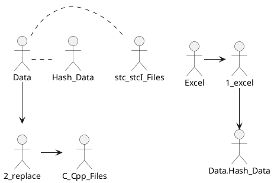
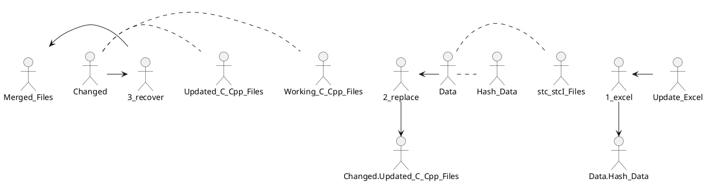

# CGA_RDL
```

   _____ _____            _____  _____  _
  / ____/ ____|   /\     |  __ \|  __ \| |
 | |   | |  __   /  \    | |__) | |  | | |
 | |   | | |_ | / /\ \   |  _  /| |  | | |
 | |___| |__| |/ ____ \  | | \ \| |__| | |____
  \_____\_____/_/    \_\ |_|  \_\_____/|______|
                     ______
                    |______|

```

## RDL
- Replacement Definition Language
- Reduce the wasting time for tedious repetitive works

## Description
- This is replacement tool with special syntax.
	- ITERATE %Hash +<<+   ....   +>>+
	- IFEQUAL(A eq B)+{{+  ....   +}}+
	- +<+ ....  +>+

# Purpose
- Reduce the wasting time for tedious repetitive works
	- Generally we have a lot of tedious repetitive job.  So in case of android , android supports to make a ASDL to make binder bn,bp services. So we can use easily with this template. But , it is just for android application.
	- I wanna make a tool for more general purpose. So We will support simple definition. The simple definitions are Loop and Condition and Replacement's statements.
- example
	- repeted works (iteration) of cases in switch 
	- repeted works (iteration) of functions
	- repeted works (iteration) of if ... elseif  ... else ...
	- repeted works (iteration) of lists

# Environment
- install perl module (cpan)
- library MY::CHARLES in perllib directory
## read excel
https://perlmaven.com/read-an-excel-file-in-perl
## Install
### perl module install
- cpan
	- install Spreadsheet::Read
		- When I run read.pl , I meet the following msg “Parser for XLSX is not installed at read.pl line 9.”
	- install Spreadsheet::XLSX


# How to run the test 
## example1 (stc)
- cd CGA_RDL
- make
	- Description
		- 1_excel.pl  ->  generate default.GV (perl hash database) from excel file
			input : 1_example.xlsx (EXCEL)
			output : default.GV
		- 2_replace.pl -> generate OUTPUT/stc/* (template file)  from stc extension file with default.GV(perl hash database)
			input : default.GV , 2_example.cpp.stc
			output : OUTPUT/stc/2_example.cpp
		- 3_recover.pl -> merge working file from template file
			input : OUTPUT/stc/2_example.cpp , 3_working.cpp.data
			output : 3_merge.cpp
	- result : OUTPUT/stc/* and 3_merge.cpp
## example2 (stcI)
- cd CGA_RDL/test/DIAG
- make
	- Description
		- 1_excel.pl  ->  generate default.GV (perl hash database) from excel file
			input : diag.xlsx (EXCEL)
			output : default.GV
		- 2_replace.pl -> generate OUTPUT/stc/* (template file)  from stc extension file with default.GV(perl hash database)
			- stc : Stencil Template C/Cpp 
			- stcI : Stencil Template C/Cpp Iterator -> make multiple file from stcI file
			input : default.GV , *.stc , *.stcI
			output : OUTPUT/stc/*
	- result : OUTPUT/stc/*

# Process
- Excel ---(1_exce.pl)---> Hash Data -----+
- _________________________stc(I) File ---+--(2_replace.pl)---> output c/cpp files

| Data | Execute | Data | Execute | Data |
|------|---------|------|---------|------|
| Excel|-(1_exce.pl)->|Hash Data|  |   |
|      |         | stc(I) File |-(2_replace.pl)-> | output c/cpp files |

- This is plantuml. You can see plantuml through editor vscode or atom with Markdown-Preview_Enhanced Module.
	- install vscode or atom
	- install java
	- install graphviz


- If you want to reuse your works after changing your excel file , 
	- Update Excel ---(1_exce.pl)---> Hash Data -----+
	- ________________________________stc(I) File ---+--(2_replace.pl)---> Updated output c/cpp file ---+
	- __________________________________________________________Worked(Changed) file from c/cpp file ---+--(3_recover.pl)---> Merged file

| Data | Execute | Data | Execute | Data | Execute | Data | 
|------|---------|------|---------|------|---------|------|
| Update Excel|-(1_exce.pl)->|Hash Data|  |   |
|      |         | stc(I) File |-(2_replace.pl)-> | Updated output c/cpp files |
|      |         |             |                  | Worked(Changed) file from c/cpp files | -(3_recover.pl)-> | Merged file



# Syntax and Explanation
- Excel file
	- [Header]AAA
		- You can use AAA name as variable name in stc/stcI file
	- [VALUE] 
		- This contents is value of hash
	- example of excel

		| [Header]PPP | CGA | [VALUE] |
		|-------------|-----|---------|
		| type        | int | 100     |
		| length      | char| C       |

```perl
		$PPP{type}{int} = 100
		$PPP{length}{char} = C
```

- default.GV
```perl
	- $PPP{type}{int} = 100
	- $PPP{length}{char} = C
```
- stc
	- FileName : DiagInputManager.cpp   -> generate file name in ./OUTPUT/stc
- stcI
	- stcI_HASH : PPP    -> generate multiple files from hash PPP (PPP is Header name in excel file.)
		- generated multiple file in example -> ???type???.???   , ???length???.???
	- stcI_EXTENSION : cpp
		- generated multiple file in example -> ???type???.cpp   , ???length???.cpp
	- stcI_FILEPREFIX : I
		- generated multiple file in example -> Itype???.cpp   , Ilength???.cpp
	- stcI_FILEPOSTFIX : Manager
		- generated multiple file in example -> ItypeManager.cpp   , IlengthManager.cpp
	- SetI : $MODULENAME = KEY
		- $MODULENAME=type in ItypeManaager.cpp
		- $MODULENAME=length in IlengthManaager.cpp
- common in stc and stcI
	- Set : $iterateInputFileName = DiagInputManager.cpp	-> use as variable. $ means variable.
		- +<+$iterateInputFileName+>+ replaces with "DiagInputManager.cpp".
	- +<+$variable+>+   ...  +<+ $hash{key} +>+
		- +<+ $variable +>+  means replacement with it.
		- you can use perl hash variable as a variable..
	- IFEQUAL(+<+$Related_Manager{vif}+>+  eq "O")+{{+
	          .......
			  ......
	  +}}+
		- condition statement
		- if true , show ........
	- ITERATE %hash +<<+ ITKEY  ITVALUE
	            ITKEY
				ITVALUE
	  +>>+
		- iterator with hash variable
		- ITKEY is key of hash (keys %hash in perl)
		- ITVALUE is value of hash ($hash{key} in perl)

