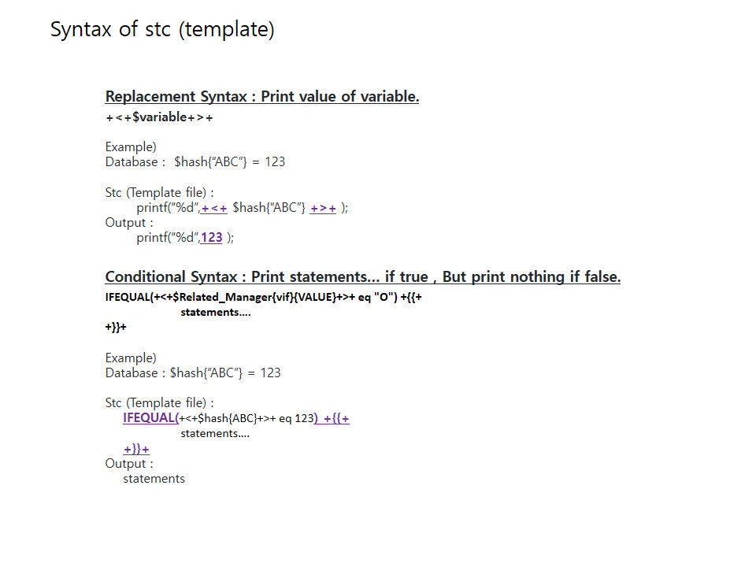
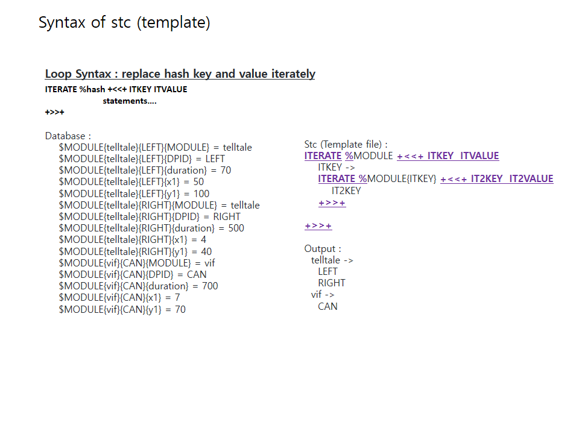
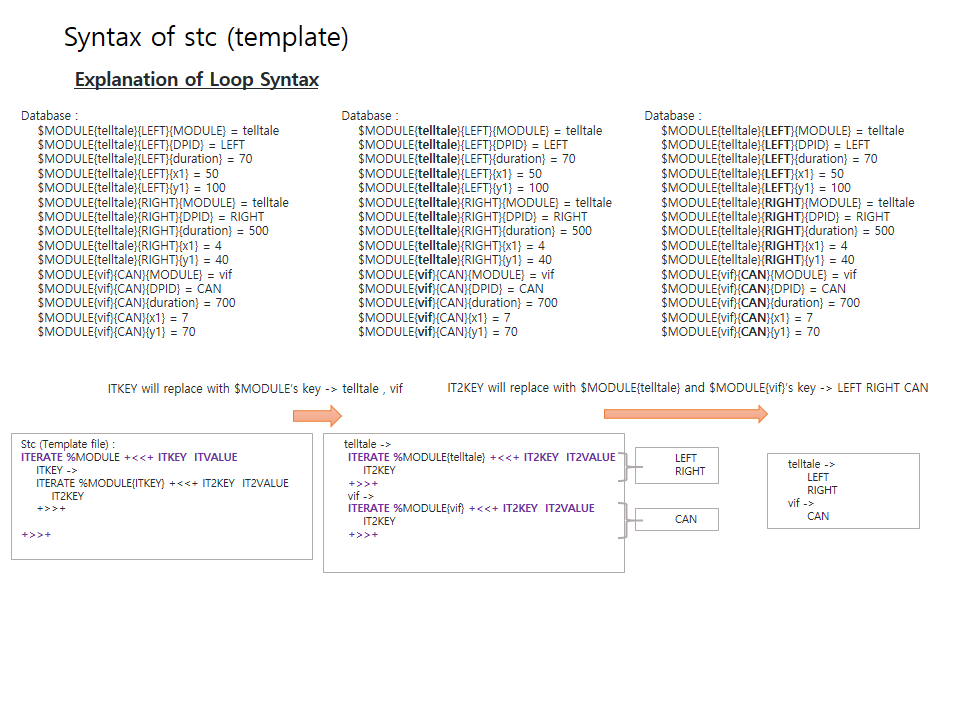
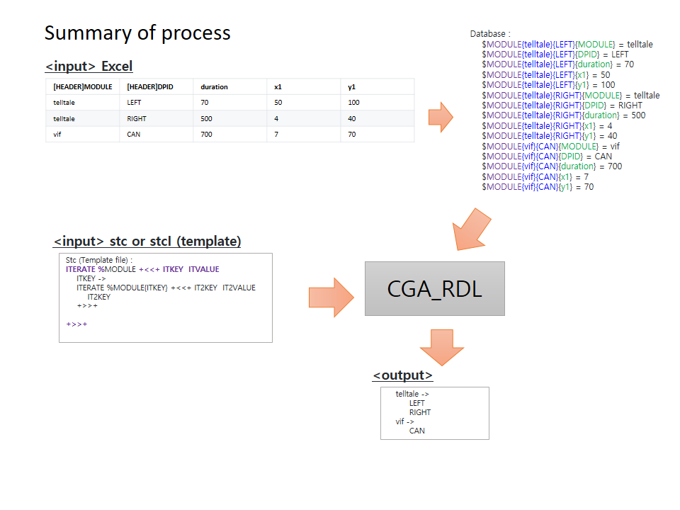
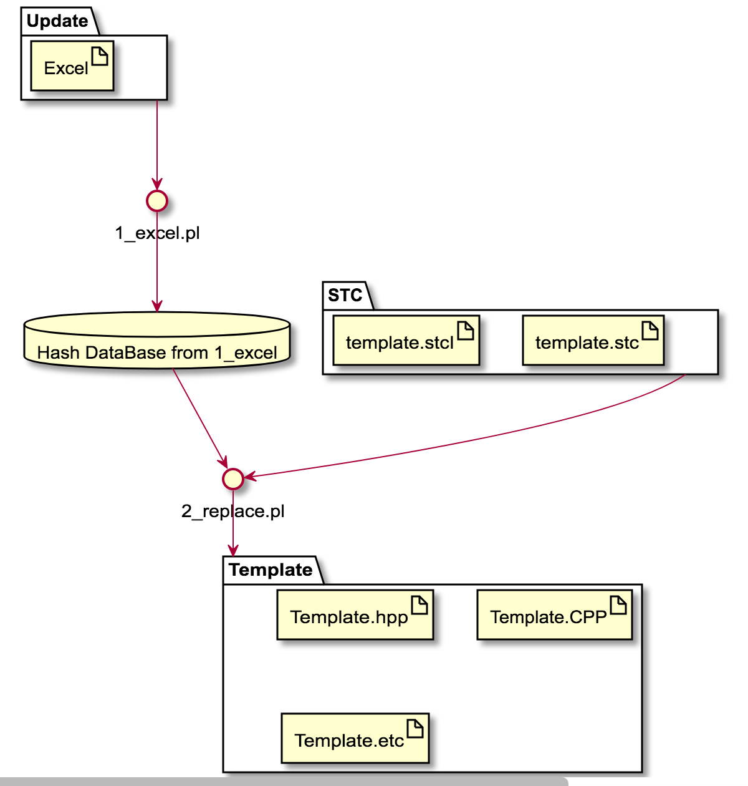

# CGA_RDL
```

   _____ _____            _____  _____  _
  / ____/ ____|   /\     |  __ \|  __ \| |
 | |   | |  __   /  \    | |__) | |  | | |
 | |   | | |_ | / /\ \   |  _  /| |  | | |
 | |___| |__| |/ ____ \  | | \ \| |__| | |____
  \_____\_____/_/    \_\ |_|  \_\_____/|______|
                     ______
                    |______|

```

## RDL
- Replacement Definition Language
- Reduce the wasting time for tedious repetitive works

## Explanation







## Description
- This is replacement tool with special syntax.
	- ITERATE %Hash +<<+   ....   +>>+
	- IFEQUAL(A eq B)+{{+  ....   +}}+
	- +<+ ....  +>+

# Purpose
- Reduce the wasting time for tedious repetitive works
	- Generally we have a lot of tedious repetitive job.  So in case of android , android supports to make a AIDL (Android Interface Definition Language) to make binder bn,bp services. So we can use easily with this template. But , it is just for android application.
	- I wanna make a tool for more general purpose. So We will support simple definition. The simple definitions are Loop and Condition and Replacement's statements.
- example
	- repeted works (iteration) of cases in switch
	- repeted works (iteration) of functions
	- repeted works (iteration) of if ... elseif  ... else ...
	- repeted works (iteration) of lists

# Environment
- install perl module (cpan)
- library MY::CHARLES in perllib directory
## read excel
https://perlmaven.com/read-an-excel-file-in-perl
## Install
### perl module install
- cpan
	- install Spreadsheet::Read
		- When I run read.pl , I meet the following msg “Parser for XLSX is not installed at read.pl line 9.”
	- install Spreadsheet::XLSX


# How to run the test
## example1 (test)
- cd CGA_RDL
- make test
	- Description
		- 1_excel.pl  ->  generate default.GV (perl hash database) from excel file
			input : test.xlsx (EXCEL)
			output : default.GV
		- 2_replace.pl -> generate OUTPUT/stc/* (template file)  from stc extension file with default.GV(perl hash database)
			input : default.GV , test.cpp.stc
			output : OUTPUT/stc/test.cpp
## example2 (stc)
- cd CGA_RDL
- make
	- Description
		- 1_excel.pl  ->  generate default.GV (perl hash database) from excel file
			input : 1_example.xlsx (EXCEL)
			output : default.GV
		- 2_replace.pl -> generate OUTPUT/stc/* (template file)  from stc extension file with default.GV(perl hash database)
			input : default.GV , 2_example.cpp.stc
			output : OUTPUT/stc/2_example.cpp
		- 3_recover.pl -> merge working file from template file
			input : OUTPUT/stc/2_example.cpp , 3_working.cpp.data
			output : 3_merge.cpp
	- result : OUTPUT/stc/* and 3_merge.cpp
## example3 (stcI)
- cd CGA_RDL/test/DIAG
- make
	- Description
		- 1_excel.pl  ->  generate default.GV (perl hash database) from excel file
			input : diag.xlsx (EXCEL)
			output : default.GV
		- 2_replace.pl -> generate OUTPUT/stc/* (template file)  from stc extension file with default.GV(perl hash database)
			- stc : Stencil Template C/Cpp
			- stcI : Stencil Template C/Cpp Iterator -> make multiple file from stcI file
			input : default.GV , *.stc , *.stcI
			output : OUTPUT/stc/*
	- result : OUTPUT/stc/*

# Process
- Excel ---(1_exce.pl)---> Hash Data -----+
- _________________________stc(I) File ---+--(2_replace.pl)---> output c/cpp files

| Data  | Execute        | Data        | Execute           | Data               |
| ----- | -------------- | ----------- | ----------------- | ------------------ |
| Excel | -(1_exce.pl)-> | Hash Data   |                   |                    |
|       |                | stc(I) File | -(2_replace.pl)-> | output c/cpp files |

- This is plantuml. You can see plantuml through editor vscode or atom with Markdown-Preview_Enhanced Module.
	- install vscode or atom
	- install java
	- install graphviz


- If you want to reuse your works after changing your excel file ,
	- Update Excel ---(1_exce.pl)---> Hash Data -----+
	- ________________________________stc(I) File ---+--(2_replace.pl)---> Updated output c/cpp file ---+
	- __________________________________________________________Worked(Changed) file from c/cpp file ---+--(3_recover.pl)---> Merged file

| Data         | Execute        | Data        | Execute           | Data                                  | Execute           | Data        |
| ------------ | -------------- | ----------- | ----------------- | ------------------------------------- | ----------------- | ----------- |
| Update Excel | -(1_exce.pl)-> | Hash Data   |                   |                                       |                   |             |
|              |                | stc(I) File | -(2_replace.pl)-> | Updated output c/cpp files            |                   |             |
|              |                |             |                   | Worked(Changed) file from c/cpp files | -(3_recover.pl)-> | Merged file |


# Relationship between each processes (excel & database & stc file )
- The Headers in excel are related to variable name in stc file.

## Explanation of Example 1 (1_example.xlsx)
### Excel
- Header starts with "[HEADER]"
- Excel file
	- [Header]MODULENAME
		- You can use MODULENAME name as variable name in stc/stcI file
	- example of excel

| [HEADER]Related_Manager | VALUE |
| ----------------------- | ----- |
| vif                     | O     |
| audio                   | X     |

```perl
$Related_Manager{vif}{Related_Manager} = vif
$Related_Manager{vif}{VALUE} = O
$Related_Manager{audio}{Related_Manager} = audio
$Related_Manager{audio}{VALUE} = X
```

### DataBase
- default.GV
```perl
  $Related_Manager{vif}{Related_Manager} = vif
  $Related_Manager{vif}{VALUE} = O
  $Related_Manager{audio}{Related_Manager} = audio
  $Related_Manager{audio}{VALUE} = X
```

### stc or stcI 's replacement
- stc
```cpp
ITERATE %Related_Manager +<<+ ITKEY  ITVALUE
IFEQUAL(+<+$Related_Manager{ITKEY}{VALUE}+>+  eq "O")+{{+
/*!! ITKEY Inheritance CGA start-------------------------------------------------*/
    m+<+ucfirst("ITKEY")+>+Manager = NULL;
    m+<+ucfirst("ITKEY")+>+Receiver = NULL;
    m+<+ucfirst("ITKEY")+>+PostReceiver = NULL;
/*!! ITKEY Inheritance CGA end-------------------------------------------------*/
+}}+
+>>+
```
  - ITKEY in ITERATE statements
    - vif  and  audio  in Related_Manager
  - +<+$Related_Manager{ITKEY}{VALUE}+>+ will be replaced with O or X
    - $Related_Manager{vif}{VALUE} = O
    - $Related_Manager{audio}{VALUE} = X
  - IFEQUAL(A eq B)+{{+ ......  +}}+
    - if A equals B , print .... in output file

## Enhanced Example 2 with multiple [HEADER] for multi-dimension
### Excel
- Header starts with "[HEADER]"
- Excel file
	- example of excel

| [HEADER]MODULE | [HEADER]DPID | duration | x1  | y1  |
| -------------- | ------------ | -------- | --- | --- |
| telltale       | LEFT         | 70       | 50  | 100 |
| telltale       | RIGHT        | 500      | 4   | 40  |
| vif            | CAN          | 700      | 7   | 70  |

```perl
    $MODULE{telltale}{LEFT}{MODULE} = telltale
    $MODULE{telltale}{LEFT}{DPID} = LEFT
    $MODULE{telltale}{LEFT}{duration} = 70
    $MODULE{telltale}{LEFT}{x1} = 50
    $MODULE{telltale}{LEFT}{y1} = 100
    $MODULE{telltale}{RIGHT}{MODULE} = telltale
    $MODULE{telltale}{RIGHT}{DPID} = RIGHT
    $MODULE{telltale}{RIGHT}{duration} = 500
    $MODULE{telltale}{RIGHT}{x1} = 4
    $MODULE{telltale}{RIGHT}{y1} = 40
    $MODULE{vif}{CAN}{MODULE} = vif
    $MODULE{vif}{CAN}{DPID} = CAN
    $MODULE{vif}{CAN}{duration} = 700
    $MODULE{vif}{CAN}{x1} = 7
    $MODULE{vif}{CAN}{y1} = 70
```

### DataBase
- default.GV
```perl
    $MODULE{telltale}{LEFT}{MODULE} = telltale
    $MODULE{telltale}{LEFT}{DPID} = LEFT
    $MODULE{telltale}{LEFT}{duration} = 70
    $MODULE{telltale}{LEFT}{x1} = 50
    $MODULE{telltale}{LEFT}{y1} = 100
    $MODULE{telltale}{RIGHT}{MODULE} = telltale
    $MODULE{telltale}{RIGHT}{DPID} = RIGHT
    $MODULE{telltale}{RIGHT}{duration} = 500
    $MODULE{telltale}{RIGHT}{x1} = 4
    $MODULE{telltale}{RIGHT}{y1} = 40
    $MODULE{vif}{CAN}{MODULE} = vif
    $MODULE{vif}{CAN}{DPID} = CAN
    $MODULE{vif}{CAN}{duration} = 700
    $MODULE{vif}{CAN}{x1} = 7
    $MODULE{vif}{CAN}{y1} = 70
```
- stc  (test.cpp.stc)
```CPP
ITERATE %MODULE +<<+ ITKEY  ITVALUE
    ITKEY ->
    ITERATE %MODULE{ITKEY} +<<+ IT2KEY  IT2VALUE
        IT2KEY
    +>>+

+>>+
```
  - OUTPUT/stc/test.cpp
```
  telltale ->
    LEFT
    RIGHT
  vif ->
    CAN
```


## Syntax and Explanation of RDL
- stc
	- FileName : DiagInputManager.cpp   -> generate file name in ./OUTPUT/stc
	- FileName : src/DiagInputManager.cpp   -> generate file name in ./OUTPUT/stc/src
	- FileName : ../DiagInputManager.cpp   -> generate file name in ./OUTPUT/
	- FileName : /tmp/DiagInputManager.cpp   -> generate file name in /tmp
- stcI
	- stcI_HASH : PPP    -> generate multiple files from hash PPP (PPP is Header name in excel file.)
		- generated multiple file in example -> ???type???.???   , ???length???.???
	- stcI_EXTENSION : cpp
		- generated multiple file in example -> ???type???.cpp   , ???length???.cpp
	- stcI_FILEPREFIX : I
		- generated multiple file in example -> Itype???.cpp   , Ilength???.cpp
	- stcI_FILEPOSTFIX : Manager
		- generated multiple file in example -> ItypeManager.cpp   , IlengthManager.cpp
	- SetI : $MODULENAME = KEY
		- $MODULENAME=type in ItypeManaager.cpp
		- $MODULENAME=length in IlengthManaager.cpp
- common in stc and stcI
	- Set : $iterateInputFileName = DiagInputManager.cpp	-> use as variable. $ means variable.
		- +<+$iterateInputFileName+>+ replaces with "DiagInputManager.cpp".
	- +<+$variable+>+   ...  +<+ $hash{key} +>+
		- +<+ $variable +>+  means replacement with it.
		- you can use perl hash variable as a variable..
	- IFEQUAL(+<+$Related_Manager{vif}{VALUE}+>+  eq "O")+{{+
	          .......
			  ......
	  +}}+
		- condition statement
		- if true , show ........
	- ITERATE %hash +<<+ ITKEY  ITVALUE
	            ITKEY
				ITVALUE
	  +>>+
		- iterator with hash variable
		- ITKEY is key of hash (keys %hash in perl)
		- ITVALUE is value of hash ($hash{key} in perl). But, we use +<+$hash{ITKEY}??+>+ instead of ITVALUE.
